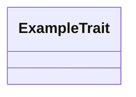

# <Subsystem Name>

<!-- Copy this template for new pages. Every section below is required, in this order. -->

## Purpose

3–5 sentences: what this subsystem does and why it exists as a separate unit.

## Position in the System

What it consumes and what consumes it, each as a link to the sibling wiki page,
with module/package names. Must mirror the dependency direction enforced by
the project's dependency/layering check, if one exists.

## Architecture

Prose walk-through of the key types/traits and their relationships.
Name types and functions; never line numbers.

## Runtime Flows

The 2–3 sequences that matter, as numbered steps referencing function/type names.

## Key Decisions

Newest first. Each entry:

### <Decision title>
- **Decision:** one sentence.
- **Context:** why the question arose.
- **Alternatives rejected:** and why.
- **Consequences:** what this commits us to.
- **Ref:** YYYY-MM-DD, PR #N (or commit SHA).

## Implementation Notes

Invariants, gotchas, known debt / open follow-ups (labeled as such).

## Source Anchors

- `example/src/lib.rs`
- `example/` (module)

<!-- The drift contract: a PR changing files under these anchors updates this page
     or says why not in the PR body. -->

## Related Pages

- [Example](example.md)
